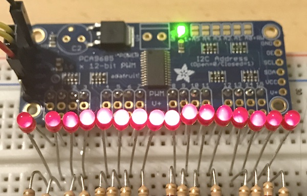
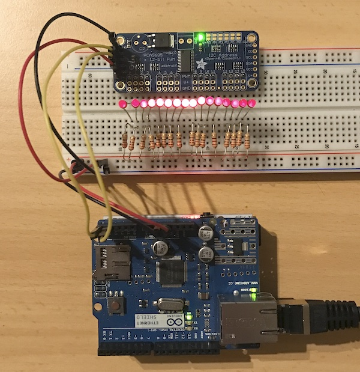

# Arduino PCA9685 UDP Dimmer

A simple approach to operate the NXP [PCA9685 16-channel 12-bit PWM i2c LED controller](https://cdn-shop.adafruit.com/datasheets/PCA9685.pdf) via network using an Arduino and an Ethernet Shield. The LED controller used is the [Adafruit 16-Channel 12-bit PWM/Servo Driver](https://www.adafruit.com/product/815) for which Adafruit provides a very good [Arduino Library](https://github.com/adafruit/Adafruit-PWM-Servo-Driver-Library).

## Use Case
The idea is to control each channel separately from an automation software via UDP. One of the main benefits over Hardware PWM from Arduino's ATMega is the resolution of the PCA9685 which is 12-bit in comparison to 8-bit. So you don't have 0-255 brightness levels but 0-4095! You have better dimming control on lower brightnesses and you get direct control of the PWM channel via UDP (nearly no lag).

If you want to drive, e.g. an RGB-Stripe from a color picker, you will be limited to 0-255 for a channel, as every color picker outputs the color values from 0-255. In that case, simply multiply the output by 16. Of course, you will lose the smoothness of 12-bit. 

Please keep in mind, that the LED Controller itself only supplies 10-25mA for each channel. So logically you have to use a Transistor or MOSFET to drive the load - see page 29 of the chip's datasheet.

## Setup and Software
Simply wire the LED Controller to the i2c bus of your Arduino, configure the wanted UDP port and wether you want the output of the PWM be inverted or not. The code is doing DHCP with the given MAC address. If you need static IP, it should be easy to modify according to the Arduino Ethernet Examples.

Don't forget to install [Adafruits PCA9685 Arduino Library](https://github.com/adafruit/Adafruit-PWM-Servo-Driver-Library).

I am controlling the device from [node-red](https://nodered.org/) with [node-red-dashboard](https://github.com/node-red/node-red-dashboard), but any simple UDP connection should work. So a home automation software that can output UDP, like Loxone, will do the job. 

Just send a terminated text string in the given format: 

    <channel-number>;<brightness>

So, for example `3;2048` will dimm channel 4 to 50%. Channel number and brightness values range from `0-15` and `0-4095`.

## History
I stumbled over a project to control a DMX Dimmer via the [Loxone Home Automation System](https://www.loxone.com/) over UDP: https://sourceforge.net/projects/udptodmx/. 
This inspired me to do the same with the PCA9685 which I had lying around from another project. The handling of UDP messages is vastly migrated from Robert L.'s work.

---

Created with Arduino 1.8.1 using an Freaduino Uno and an Arduino W5100 Ethernet Shield.

